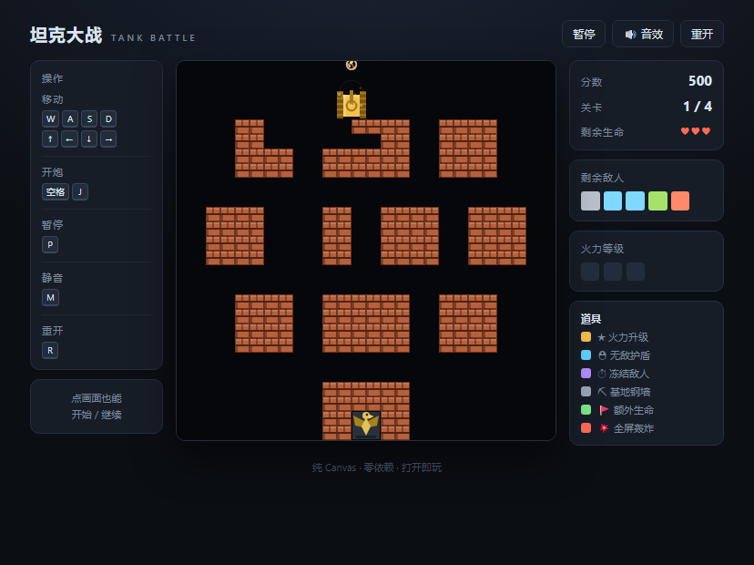

# 坦克大战 · Tank Battle

纯 HTML5 Canvas 写的经典坦克大战复刻，**零依赖、零构建**，双击 `index.html` 就能玩。

🔗 **在线试玩：<https://hejialun777.github.io/tank-battle/>**




---

## 玩法

守住屏幕底部正中的**老鹰基地**，消灭全部敌方坦克。基地被摧毁或生命耗尽即游戏结束。

| 操作 | 按键 |
| --- | --- |
| 移动 | `W` `A` `S` `D` 或 `↑` `←` `↓` `→` |
| 开炮 | `空格` 或 `J` / `K` |
| 暂停 | `P` 或 `Esc` |
| 重开 | `R` |
| 静音 | `M` |

这几个键在游戏界面**左侧常驻显示**，不用记。场上也支持点画面直接开始 / 继续。

### 规则要点

- **砖墙**可以被打碎。一发子弹轰掉一条，**同一个位置连打两发**才能开出一个坦克宽的路口 —— 想抄近路就得先拆墙。
- **钢墙**普通子弹打不动，只有火力满级（★★★）的子弹能穿透。
- **河流**坦克过不去，子弹可以飞过去。**草丛**不阻挡任何东西，但画在坦克上面，可以藏身。
- 老鹰周围的砖墙就是最后一道防线。**你自己的子弹打不坏自己的基地**（原版会，但那纯属手滑送命）。

### 道具

打掉**红色闪光**的敌人会掉道具，开车碾过去即可拾取：

| 道具 | 效果 |
| --- | --- |
| ★ 火力升级 | 提升火力等级（最高 3 级：更快子弹 → 双发 → 穿透钢墙） |
| ⛑ 无敌护盾 | 10 秒无敌 |
| ⏱ 冻结敌人 | 全场敌人停止行动 8 秒 |
| ⛏ 基地钢墙 | 基地周围的砖墙临时变成钢墙 15 秒 |
| 🚩 额外生命 | 生命 +1 |
| 💥 全屏轰炸 | 立刻消灭场上所有敌人 |

持有道具的敌人每关出现 3 次（按出场顺序在 1/4、1/2、3/4 处）。

### 敌人

| 类型 | 特点 | 分值 |
| --- | --- | --- |
| 基础（灰） | 速度慢，火力普通 | 100 |
| 快速（蓝） | 移动速度是基础型的两倍多 | 200 |
| 炮击（绿） | 子弹极快，可以同时打两发 | 300 |
| 装甲（橙） | 需要命中 4 次，掉血后会变色 | 400 |

敌人 AI 出生时会随机"锁定猎物"（追玩家或直奔基地），中途偶尔改主意，其余时间四处游荡 —— 所以不会一窝蜂直冲老家，但你也不能不管它。

---

## 运行

```bash
git clone <本仓库地址>
cd tank-battle
```

然后直接双击 `index.html` 就行。

代码刻意没有用 ES Module，所以 `file://` 协议下也能跑，不需要起本地服务器。想用服务器的话：

```bash
python -m http.server 8000
# 或者
npx serve
```

### 部署到 GitHub Pages

已经开好了，站点地址：<https://hejialun777.github.io/tank-battle/>

仓库根目录就是站点根目录。如果你 fork 了一份想自己部署，在 **Settings → Pages** 里把 Source 选成 `main` 分支的 `/ (root)` 即可（注意：**私有仓库开不了 Pages**，需要仓库是公开的）。

---

## 项目结构

```
.
├── index.html          页面骨架 + 侧栏 HUD + 遮罩层
├── css/
│   └── style.css       外壳样式（游戏本体全部画在 canvas 上）
└── js/
    ├── utils.js        常量与工具函数（TB 命名空间）
    ├── audio.js        WebAudio 合成音效，不依赖任何音频文件
    ├── input.js        键盘输入（按住 / 一次性动作两种语义）
    ├── levels.js       关卡地图、敌人编成、敌人属性表
    ├── map.js          地形数据 + 子格碰撞 + 破坏规则
    ├── effects.js      爆炸 / 火花 / 飘分
    ├── bullet.js       子弹推进与命中裁决
    ├── powerup.js      六种道具
    ├── tank.js         坦克公共逻辑 + 玩家坦克 + 敌方 AI
    ├── game.js         状态机、关卡流程、渲染
    └── main.js         启动脚本，把 Game 和 DOM 接起来
```

所有模块挂在全局 `TB` 命名空间上，用普通 `<script>` 按依赖顺序加载。

### 一些实现细节

- **坐标系统**：战场 416×416，13×13 格，每格 32px。碰撞和破坏按 **16px 的半格** 判定，所以砖墙能被打出精确的缺口。
- **坦克永远停在 16px 的网格上**，转向时自动吸附。撞墙时会朝最近的通道中心滑一点，但只有确认滑过去真的能继续走才会滑 —— 所以钻窄道不会手忙脚乱。
- **打墙规则**：一发子弹只打掉"顺着炮口的那一条"，打空了自动挪到旁边一条。因此两发正好开出一个坦克宽的口子。
- **防卡死**：如果有坦克被别的坦克四面堵死（比如出生点被挤住），超过 0.8 秒会短暂关闭坦克之间的碰撞让它们散开，避免关卡永远打不完。

---

## 自己改

### 加一关

在 `js/levels.js` 的 `TB.LEVELS` 里追加一项即可。地图是 13 行 × 13 列的字符串：

```js
{
  name: '第五关 · 你的关卡',
  map: [
    '.............',   // .  空地
    '..##.###.##..',   // #  砖墙（可打碎）
    '..##.###.##..',   // @  钢墙（满级火力才打得穿）
    '.............' ,  // ~  河流（坦克过不去）
    '.....***.....',   // *  草丛（不阻挡，画在最上层）
    // ...
  ],
  enemies: army([['b', 6], ['f', 4], ['p', 3], ['a', 3]]),
  maxAlive: 4,          // 同时最多几辆在场
  spawnInterval: 2.2    // 出场间隔（秒）
}
```

注意：

- 基地固定在**第 12 行第 6 列**，地图里不用写，写了也会被覆盖。
- 玩家出生在**第 12 行第 4 列**，敌人出生在**第 0 行的第 0 / 6 / 12 列**，这些位置必须留空。
- 基地周围那圈砖墙（`TB.BASE_WALLS`）请照着现有几关的写法保留，否则"基地钢墙"道具会失效。

### 调难度

- `maxAlive` 调低、`spawnInterval` 调高 = 更轻松。
- `js/tank.js` 里的 `EnemyTank.AGGRESSION` 控制各型号"追玩家而不是拆家"的概率，调高会更护家、更黏人。
- `js/levels.js` 里的 `TB.ENEMY_STATS` 是敌人属性表，速度 / 血量 / 分值都能改。

---

## 关于难度

老实说，**这游戏偏难**，跟原版一样——老鹰四周只有一层砖，敌人两发就能轰开，然后一发带走基地。所以你不能只顾着在外面刷分，得时不时回防。

我用一个会寻路的机器人代打做了平衡测试（脚本在开发过程中用来跑回归，没进仓库）：机器人能稳定过第一关、多数时候过第二关、偶尔摸到第三关。它的失败几乎全是"基地被摧毁"——因为它只会闷头追杀，从不回防。**会守家的玩家应该明显打得更好。**

如果觉得太苦，把 `maxAlive` 改成 3、`spawnInterval` 加 0.5，体感会松快很多。

---

## License

[MIT](LICENSE)
